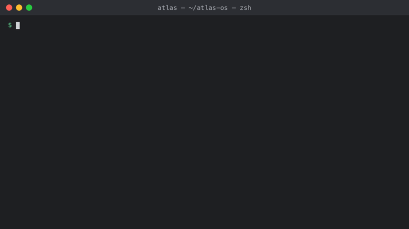

```
    _____ _     _      _   _         ___  ____
   | ____(_) __| | ___| |_(_) ___   / _ \/ ___|
   |  _| | |/ _` |/ _ \ __| |/ __| | | | \___ \
   | |___| | (_| |  __/ |_| | (__  | |_| |___) |
   |_____|_|\__,_|\___|\__|_|\___|  \___/|____/

   Turn your Obsidian vault into a searchable AI knowledge base.
   Local LLMs · hybrid RAG search · web dashboard · 160+ skills.
   A personal AI operating system that remembers everything · works while you sleep.
```

# Eidetic OS

> **Turn your Obsidian vault into a searchable AI knowledge base** — with local
> LLMs, hybrid RAG search, a web dashboard, and 160+ skills. Eidetic OS is a
> personal AI operating system that remembers everything and works while you
> sleep.

*<a href="https://www.merriam-webster.com/dictionary/eidetic">**Eidetic**</a>
(adj.) — relating to **total, photographic recall**. The name is the promise:
your AI never forgets. (Formerly **Atlas OS** — [why we
renamed](#why-the-name-atlas-os--eidetic-os).)*

[](https://github.com/paulholland511/eidetic-os/actions/workflows/ci.yml)
[](https://pypi.org/project/eidetic-os/)
[](LICENSE)
[](https://www.python.org/)
[](https://github.com/paulholland511/eidetic-os/stargazers)
[](https://github.com/paulholland511/eidetic-os/commits/main)
[](docs/DATA-CLASSIFICATION.md)
[](SECURITY.md)
[](docs/README.md)


### ✅ Already built and shipping

Everything below is **in the box today** — not roadmap, not "coming soon":

- 🔍 **Hybrid RAG search** — BM25 keyword + vector semantic search over your whole vault, fused into one ranked result set
- 📓 **Obsidian vault integration** — point Eidetic at your markdown vault and it becomes a searchable, AI-aware second brain
- 💾 **Session capture** — every Cowork conversation saved to your vault twice daily
- 🧠 **Mem0-style fact memory** (`eidetic facts`) — distil discrete facts from conversations and deduplicate against existing memory (insert / bump / supersede / merge), with LLM extraction and a heuristic offline fallback
- 🔌 **Local LLM backends** — auto-detects Ollama, LM Studio, llama.cpp, or any OpenAI-compatible endpoint; nothing leaves your machine
- 📊 **Web dashboard** (`eidetic dashboard`) — seven live panels: health, audit, tasks, skills, knowledge graph, vectors, RAG search
- 🧩 **Native Obsidian plugin** (`eidetic serve`) — search memory, browse facts, and extract facts from a note inside Obsidian, via a local CORS API
- 🕸️ **Visual knowledge graph** — interactive D3 view of how your notes connect (`eidetic graph --open`)
- 🧙 **Interactive setup wizard** (`eidetic init`) — zero to running in 5 minutes
- 📋 **Audit trail** — append-only JSONL logging every autonomous action (ISO 27001 aligned)
- 🐳 **Docker support** — `Dockerfile` + `docker-compose.yml` included
- 🩺 **Smart diagnostics** — `eidetic doctor --fix` detects and repairs issues automatically
- ✅ **640+ automated tests** with CI/CD on every push
- 📚 **160+ skills catalogue** with one-command `eidetic skills install-pack`
- 🛒 **Skills marketplace** — search, publish, and install community skills (`eidetic skills search` / `publish` / `registry`)
- 🧩 **Extension architecture** — a lean core plus opt-in domain extensions (`pip install 'eidetic-os[trading]'`), discovered via setuptools entry points
- 🔗 **MCP-native skills** — every skill is a Model Context Protocol server, usable from Claude Code, Cowork, and any MCP host (`eidetic mcp serve`)
- 🛡️ **Skill security gate** — AST scan (BLOCK / WARN / INFO) plus a sandboxed runtime before community skills run (`eidetic security scan`)
- ✅ **Verification gates** — a GROUND-style 5-tier pipeline (syntax · imports · tests · runtime · diff) that vets code before autonomous execution, halting at the first blocking failure (`eidetic verify`)
- 🔒 **Hardened git sync** — favour-local merges that never clobber your edits, frontmatter validation, and file locking (`eidetic sync`, `eidetic validate`)
- 🗄️ **Pluggable vector storage** — `sqlite-vec` by default, swap in LanceDB, ChromaDB, or server-backed **Valkey Search** via `VECTOR_BACKEND` (`eidetic migrate-vectors --to`)

---

**Eidetic OS** turns [Claude Cowork](https://claude.ai/) into a personal,
local-first operating system over a markdown knowledge vault. It gives you a
searchable second brain, scheduled autonomous agents, automatic git history, and
a set of report/research workflows — all configured through environment
variables and runnable entirely on your own machine.

Crucially, **everything you discuss with Claude gets captured into your vault** —
conversations, research, code sessions, decisions. Nothing is lost between
sessions. Your vault becomes a complete, searchable record of your AI-assisted
work that gets smarter the more you use it.

It ships with **no personal data, no credentials, and no PII**. Everything is a
template you point at your own vault, your own local LLM, and your own email
account.

> **Privacy by default.** Your notes and embeddings never leave your machine
> unless *you* explicitly wire up an external endpoint. See
> [`SECURITY.md`](SECURITY.md) and
> [`docs/DATA-CLASSIFICATION.md`](docs/DATA-CLASSIFICATION.md).

---

## Table of contents

- [Quick start](#quick-start)
- [Tutorial](#tutorial)
- [Why Eidetic OS](#why-eidetic-os)
- [Why the name? (Atlas OS → Eidetic OS)](#why-the-name-atlas-os--eidetic-os)
- [How Eidetic OS compares](#how-eidetic-os-compares)
- [Features](#features)
- [Prerequisites](#prerequisites)
- [Installation](#installation)
- [Dependencies](#dependencies)
- [First run (walkthrough)](#first-run-walkthrough)
- [The `eidetic` CLI](#the-eidetic-cli)
- [Configuration](#configuration)
- [Architecture](#architecture)
- [The knowledge vault](#the-knowledge-vault)
- [Session capture & knowledge persistence](#session-capture--knowledge-persistence)
- [Fact memory (`eidetic facts`)](#fact-memory-eidetic-facts)
- [RAG search & knowledge graph](#rag-search--knowledge-graph)
- [Scheduled tasks & the skills catalog](#scheduled-tasks--the-skills-catalog)
- [Trading research SDK (optional)](#trading-research-sdk-optional)
- [Email reports](#email-reports)
- [Dashboard (optional)](#dashboard-optional)
- [Audit trail](#audit-trail)
- [Verification gates (`eidetic verify`)](#verification-gates-eidetic-verify)
- [Security & privacy](#security--privacy)
- [Repository layout](#repository-layout)
- [Documentation](#documentation)
- [Troubleshooting](#troubleshooting)
- [Frequently asked](#frequently-asked)
- [Roadmap](#roadmap)
- [Development & testing](#development--testing)
- [Contributing](#contributing)
- [License & disclaimer](#license--disclaimer)

---

## Quick start

New here? Get a working setup in **5 minutes** — clone, set three env vars,
scaffold a vault, and run your first task:

👉 **[docs/QUICKSTART.md](docs/QUICKSTART.md)**

**Install** — clone, create a venv, install the `eidetic` CLI:



```bash
git clone https://github.com/paulholland511/eidetic-os.git && cd eidetic-os
python3 -m venv .venv && source .venv/bin/activate
pip install -r requirements.txt && pip install -e .
```

**Set up** — configure and scaffold your vault with the interactive wizard:


```bash
cp .env.example .env          # set VAULT_PATH, USER_EMAIL, SMTP_APP_PASSWORD
eidetic init --yes              # scaffold + git-init your vault
eidetic doctor                  # verify
```

For step-by-step integration walkthroughs (Gmail SMTP, LM Studio, first
scheduled task, first RAG embed) see **[docs/EXAMPLES.md](docs/EXAMPLES.md)**.

---

## Tutorial

Want the full guided walkthrough instead of the 5-minute sprint? **[Your first 24
hours with Eidetic OS](docs/TUTORIAL.md)** takes a brand-new user from
`pip install eidetic-os` to an autonomous system — install & init, your first
vault and commit, building the RAG vector store and knowledge graph, scheduling
your first nightly task, wiring up email reports, and reading the audit trail the
next morning. No prior knowledge of Obsidian, RAG, or embeddings assumed.

👉 **[docs/TUTORIAL.md](docs/TUTORIAL.md)**

---

## Why Eidetic OS

Out of the box, Claude is a brilliant but **stateless** assistant: it forgets
everything between sessions, can't act while you're away, and knows nothing about
the work you did last week. Eidetic OS is the configuration layer that fixes that —
it turns Claude Cowork into a **persistent, autonomous, knowledge-aware operating
system** that runs on your own machine.

You don't get another chatbot. You get an assistant that *remembers, retrieves,
and acts on its own*.

### Stock Claude forgets. Eidetic OS remembers everything.

The single biggest difference Eidetic OS makes is **knowledge persistence**:

- **Stock Claude forgets everything between sessions.** Close the tab and the
  context is gone — last week's research, yesterday's planning discussion, the
  reasoning behind a decision.
- **Eidetic OS captures every conversation automatically.** Twice a day (by
  default), every Cowork session is folded back into your vault as a searchable
  note — the summary, the key actions taken, and the files touched.
- **Your vault becomes a searchable, RAG-indexed knowledge base of everything
  you've ever discussed with Claude.** Research sessions, code reviews, planning
  discussions, debugging threads — all retrievable months later by meaning, not
  just keyword.
- **Research done via the deep-research skills gets embedded alongside your
  conversations.** `deep-research`, `autoresearch`, and `topic-research-brief`
  all write their findings into the vault, where the RAG pipeline indexes them
  into the same knowledge graph as your chats.
- **Over time, your vault gets smarter** because it holds the full context of
  your work. Every captured session and every embedded research brief sharpens
  what Claude can retrieve and reason over the next time you ask.

The result: nothing you do with Claude is ever lost. Your vault is the
institutional memory of your AI-assisted work.

### What Eidetic OS actually sets up

A single `eidetic init` wires Claude into a coherent system:

- **Automatic session capture** — every conversation you have in Cowork is
  saved back into your vault as a searchable note (twice daily by default), so
  research, code sessions, planning, and decisions are preserved permanently
  rather than lost when the tab closes.
- **Persistent memory across sessions** — a structured memory store and a
  git-tracked markdown vault, so Claude carries context forward instead of
  starting cold every time.
- **A knowledge base that grows smarter over time** — a local RAG pipeline
  (chunk → embed → hybrid vector+keyword search) plus a `[[wikilink]]` knowledge
  graph, so every note you add makes retrieval sharper.
- **Automated vault management** — frontmatter schemas kept consistent
  automatically and auto-commits with a categorised git history, so your second
  brain stays tidy without you curating it.
- **Scheduled tasks that run autonomously** — nightly indexing, morning
  briefings, daily reports, weekly health checks — Claude Cowork *skills* that
  fire on a cadence and do real work while you're away.
- **Multi-agent orchestration** — a self-updating skills catalog and a
  dependency-light multi-agent research framework, so agents can discover and
  invoke every automation you've configured. A
  [**catalogue of 160+ skills**](docs/SKILLS-CATALOGUE.md) (149 capability skills
  across 7 domains, plus the Eidetic-native and scheduled automations) documents
  the full menu, and the [**skills framework**](docs/SKILLS-FRAMEWORK.md) shows
  how to author your own.
- **Local LLM integration** — embeddings and inference run against your own
  LM Studio / Ollama / llama.cpp endpoint by default; nothing leaves the box
  unless you wire it up yourself.
- **Voice, trading, and email automation** *(optional)* — TTS health hooks,
  a local-first market-research SDK that writes briefings into your vault, and a
  credential-free SMTP sender that emails you reports on schedule.
- **An append-only audit trail** — every autonomous action (embed, commit,
  email, trading, …) is logged to a tamper-evident JSONL trail recording what
  ran, how it was triggered, the outcome, duration, and what changed — queryable
  and exportable to CSV for compliance.

### What you get

- **A Claude that remembers everything** — past decisions, projects, and context
  are one search away, not lost to the last session boundary. Every conversation
  and research session is captured into the vault automatically and indexed for
  RAG search, so months later you can ask "what did we decide about X?" and get
  the real answer.
- **Daily operations that run themselves** — wake up to an indexed vault, a
  committed history, and a briefing in your inbox, all done overnight.
- **A professional-grade AI assistant that runs locally** — your notes,
  embeddings, and knowledge graph stay on your disk; the only external calls are
  ones you explicitly enable. No telemetry, ever.
- **Total transparency** — the "database" is a folder of markdown, the "API" is
  a set of small inspectable Python scripts, and history is plain git. Everything
  is diffable, portable, auditable, and yours.
- **A full audit trail of what Claude did** — every autonomous action appends to
  an append-only log (`eidetic audit show`), so you can answer "what ran overnight,
  why, and what did it change?" and export the record for compliance.

The unit of work is a *skill* — a Claude Cowork prompt that runs on a schedule
and orchestrates the Python tooling below. That's the difference between *chatting
with your notes* and *running an operating system over them*.

---

## Why the name? (Atlas OS → Eidetic OS)

This project shipped its first three major versions as **Atlas OS**. As of
**v4.0** it is **Eidetic OS**. Two reasons drove the change:

1. **Namespace collisions.** "Atlas OS" was already heavily overloaded — most
   visibly by [AtlasOS](https://atlasos.net/), the Windows debloater (**20.8K+
   GitHub stars**), and by Fluidstack's bare-metal "Atlas OS". Sharing a name
   with a Windows tweaking tool buried us in search results and created constant
   confusion about what this project actually is.
2. **The name should say what it does.** *Eidetic* means **perfect, photographic
   memory recall** — which is the entire point. Stock Claude forgets between
   sessions; Eidetic OS captures every conversation, embeds it, and makes it
   retrievable forever. The name now *is* the value proposition: **your AI never
   forgets.**

Nothing about the architecture changed in the rename — only the brand. The Python
package is now `eidetic-os`, the CLI command is `eidetic`, and imports are
`eidetic_os.*`. (The GitHub repository is now `paulholland511/eidetic-os`; the old
`paulholland511/atlas-os` URL still redirects there.) Legacy state is migrated for
you automatically:
on first run Eidetic OS copies an existing `.atlas/` directory to `.eidetic/` and
maps any `ATLAS_*` environment variables to their `EIDETIC_*` equivalents,
printing a deprecation notice for each. The old PyPI package `atlas-os` still
installs too — it now just pulls in `eidetic-os` and warns. Upgrading from a 3.x
checkout? See [`docs/MIGRATION.md`](docs/MIGRATION.md).

---

## How Eidetic OS compares

Eidetic OS sits at the intersection of a **memory layer** (Letta, Mem0) and a
**personal-knowledge AI** (Khoj) — but it is the only one whose source of truth
is a **plain, git-versioned Obsidian vault you fully own**, and the only one that
runs **autonomous scheduled agents** over that vault out of the box.

| | **Eidetic OS** | **Letta** (MemGPT) | **Mem0** | **Khoj** | **gAIOS** |
|---|:---:|:---:|:---:|:---:|:---:|
| **Primary focus** | Personal AI **OS** over your notes | Stateful **agent** framework | **Memory layer** for apps | AI **second brain** / search | General AI assistant OS |
| **Source of truth** | **Markdown vault (yours)** | Server DB | Vector + graph DB | Index over docs | App DB |
| **Runs fully local** | ✅ default | ✅ self-host | ⚠️ cloud-first | ✅ self-host | ⚠️ varies |
| **Obsidian / markdown native** | ✅ first-class | ❌ | ❌ | ✅ (plugin) | ❌ |
| **Hybrid RAG** (BM25 + vector + rerank) | ✅ | ⚠️ vector | ✅ | ✅ vector | ⚠️ |
| **`[[wikilink]]` knowledge graph** | ✅ + D3 viewer | ❌ | ✅ graph memory | ❌ | ❌ |
| **Autonomous scheduled agents** | ✅ 17+ pipelines | ❌ (you build) | ❌ | ⚠️ automations | ⚠️ |
| **MCP-native skills** | ✅ every skill is an MCP server | ⚠️ tools | ⚠️ | ⚠️ | ❌ |
| **Git-versioned & portable** | ✅ plain files + git | ❌ | ❌ | ❌ | ❌ |
| **Append-only audit trail** | ✅ JSONL, exportable | ❌ | ❌ | ❌ | ❌ |
| **Pluggable local LLM backends** | ✅ LM Studio / Ollama / llama.cpp | ✅ | ✅ | ✅ | ⚠️ |
| **No telemetry** | ✅ never | ⚠️ | ⚠️ cloud | ✅ self-host | ⚠️ |
| **License** | MIT | Apache-2.0 | Apache-2.0 | AGPL-3.0 | — |

*Comparison reflects each project's typical/default posture as of mid-2026;
all are excellent in their own lane. ✅ first-class · ⚠️ partial/conditional ·
❌ not a focus. Corrections welcome via PR.*

---

## Features

Twelve composable systems, each usable on its own:

1. **Session capture** — every Cowork conversation is automatically saved back
   into your vault as a searchable session log (twice daily by default).
   Research, code reviews, planning, and decisions are preserved permanently and
   RAG-indexed alongside your notes — nothing discussed with Claude is ever lost.
   See [session capture](#session-capture--knowledge-persistence).
2. **Knowledge vault** — a folder of markdown notes (Obsidian-friendly) where
   top-level folders carry meaning and per-folder YAML frontmatter is kept
   consistent automatically. See [the vault](#the-knowledge-vault).
3. **Local RAG search** — semantic-chunk + embed your notes via a local LLM into
   a SQLite vector store (`.rag/vectors.db`, `sqlite-vec`-accelerated with a
   pure-Python fallback). **Hybrid** retrieval fuses BM25 + vector ranking and
   reranks the result; query it with `eidetic search`. See
   [RAG search](#rag-search--knowledge-graph).
4. **Pluggable LLM backends** — bring whatever OpenAI-compatible server you run.
   Eidetic OS auto-detects LM Studio, Ollama, llama.cpp, or any custom endpoint
   (probed in that order), with `EIDETIC_LLM_BACKEND` to force one. Inspect with
   `eidetic backends` / `eidetic backends test`.
5. **Knowledge graph** — a wikilink (`[[note]]`) graph with nodes, edges,
   adjacency, and backlinks for "related notes", plus an interactive **D3
   force-directed viewer** (`eidetic graph --open`, or the dashboard's `/graph`
   page) — zoom, pan, search, filter by note type, and click through links and
   backlinks.
6. **Git automation** — auto-commit the vault with messages categorised by which
   folders changed, and generate changelogs for a morning briefing.
7. **Scheduled tasks, skills catalog & marketplace** — nightly indexing, daily
   reports, weekly health checks and more, as Claude Cowork skills — plus a
   self-updating `Skills Catalog.md` in the vault so agents can discover every
   automation they can invoke, and a **skills marketplace** (`eidetic skills
   search` / `publish` / `registry`) for sharing and installing community skills
   from JSON registries with dependency resolution.
8. **Email reports** — a credential-free SMTP sender for status reports and
   newsletters (password from the environment, never hardcoded).
9. **Trading research SDK** *(optional)* — a dependency-light multi-agent
   market-research framework that writes briefings into your vault.
   *Not financial advice.*
10. **Web dashboard** *(optional)* — a local-first Flask web UI (`eidetic
   dashboard`) with seven live panels (system health, audit trail, scheduled
   tasks, skills, knowledge graph, vector-store stats, RAG search), reading from
   the same modules the CLI uses. Plus a static, single-file ops dashboard for
   embedding in your own page. See [the dashboard](#dashboard-optional).
11. **Voice / TTS hooks** *(optional)* — health-check probes for a local TTS
   service.
12. **Audit trail / logging** — append-only JSONL logging of every autonomous
   action (what ran, how it was triggered, the outcome, duration, and what
   changed), with `eidetic audit show / tail / export` for inspection and CSV
   compliance reports. ISO 27001 aligned (A.12.4).

> **How does each one work?** Every feature has a deep-dive doc (internals, data
> formats, config) in [`docs/features/`](docs/features/README.md) — e.g.
> [how RAG works](docs/features/rag-search.md),
> [how trading works](docs/features/trading-sdk.md),
> [the knowledge graph](docs/features/knowledge-graph.md).

---

## Prerequisites

| Requirement | Needed for | Notes |
|---|---|---|
| **Python 3.11+** (3.13 recommended) | everything | the CLI and scripts |
| **Git** | vault history, changelog | your vault becomes its own git repo |
| A **markdown vault** | everything | any folder of `.md` files; Obsidian optional |
| **[uv](https://docs.astral.sh/uv/)** or **[pipx](https://pipx.pypa.io/)** | easy install | recommended way to install the `eidetic` command |
| **Claude Cowork** subscription | skills, scheduled tasks, memory | the Python tooling runs standalone without it |
| A **local LLM** (OpenAI-compatible) | RAG search, trading module | [LM Studio](https://lmstudio.ai/), [Ollama](https://ollama.com/), llama.cpp, … |
| **Node.js** | the *full* dashboard only | the bundled static dashboard needs nothing |

> Without a local LLM, the vault, frontmatter schemas, git automation,
> changelog, email, and health check all still work — only RAG and trading need
> an embeddings/chat endpoint.

**Getting a local LLM (example, LM Studio):** install it, download an embeddings
model (e.g. `nomic-embed-text`) and a chat model, then start its local server
(default `http://localhost:1234`). `eidetic init` auto-detects it. For Ollama:
`ollama serve` then `ollama pull nomic-embed-text`.

Eidetic OS works with **any** OpenAI-compatible server. It auto-detects LM Studio,
Ollama, llama.cpp, or a custom endpoint (probed in that order) — run
`eidetic backends` to see what's reachable and `eidetic backends test` to confirm
inference. Force a specific one with `EIDETIC_LLM_BACKEND=ollama`.

---

## Installation

### Recommended — install the `eidetic` command

[Eidetic OS is on PyPI](https://pypi.org/project/eidetic-os/) — install it directly:

```bash
# uv (fast, isolated):
uv tool install eidetic-os

# …or pipx:
pipx install eidetic-os

# …or pip:
pip install eidetic-os
```

> **Automated releases.** Each `v*` tag builds, tests, and publishes to PyPI via
> GitHub Actions + [PyPI Trusted Publishing](https://docs.pypi.org/trusted-publishers/)
> (OIDC, no stored token). To track `main` ahead of a release, install from git:
> `uv tool install "git+https://github.com/paulholland511/eidetic-os"`. See
> [`docs/PUBLISHING.md`](docs/PUBLISHING.md) for the release runbook.

**With optional extras** (trading needs `yfinance`, PDF embedding needs
`pdfplumber`, the web dashboard needs `flask`):

```bash
uv tool install "eidetic-os[dashboard,trading,pdf]"
# extras: [dashboard]  [trading]  [pdf]  [vector]  [all]
```

### From a source checkout (for development)

```bash
git clone https://github.com/paulholland511/eidetic-os.git ~/code/eidetic-os
cd ~/code/eidetic-os
python3 -m venv .venv && source .venv/bin/activate
pip install -e .                 # installs the `eidetic` CLI + core deps
pip install -e ".[trading,pdf]"  # optional extras
```

> On Python 3.14 the editable console script can be flaky; if `eidetic` doesn't
> resolve, use `python -m eidetic_os <command>`, which always works from a
> checkout. (On macOS this happens when the checkout lives in an iCloud-synced
> folder: iCloud sets the `hidden` flag on the editable `.pth`, and Python 3.13+
> skips hidden `.pth` files. Fix it with
> `chflags nohidden .venv/lib/python*/site-packages/*.pth`, or keep the venv
> outside iCloud.)

### No install at all (run the scripts directly)

```bash
git clone https://github.com/paulholland511/eidetic-os.git ~/code/eidetic-os
cd ~/code/eidetic-os
python3 -m venv .venv && source .venv/bin/activate
pip install requests pyyaml pdfplumber
cp .env.example .env && $EDITOR .env     # at minimum set VAULT_PATH
set -a; source .env; set +a
python3 scripts/health_check.py
```

### Or run in Docker (no host Python)

```bash
docker build -t eidetic-os .      # add --build-arg EXTRAS=".[all]" for trading/pdf
VAULT_PATH=~/Documents/Obsidian/MyVault docker compose run --rm eidetic doctor
```

Full details in the [Docker section](#docker-optional) below.

### Updating / uninstalling

```bash
uv tool upgrade eidetic-os        # or: pipx upgrade eidetic-os
uv tool uninstall eidetic-os      # or: pipx uninstall eidetic-os
```

---

## Dependencies

Eidetic OS is deliberately dependency-light. The full, pinned list lives in
[`requirements.txt`](requirements.txt):

```bash
pip install -r requirements.txt      # core, pinned to tested versions
# or, via the packaged extras:
pip install ".[trading,pdf]"
```

| Package | Pin | Needed for |
|---|---|---|
| `requests` | `2.34.2` | HTTP — embeddings, chat, SMTP probes, trading APIs (**core**) |
| `pyyaml` | `6.0.3` | frontmatter parsing / schema enforcement (**core**) |
| `typer` | `0.26.6` | the `eidetic` CLI (**core**) |
| `python-dotenv` | `1.2.2` | auto-loading `.env` (**core**) |
| `yfinance` | `1.4.1` | market data — trading SDK *(optional `[trading]`)* |
| `pdfplumber` | `0.11.9` | PDF text extraction for RAG *(optional `[pdf]`)* |
| `anthropic` | `0.105.2` | the opt-in cloud trading step only *(optional)* |

Everything else (numpy, pandas, certifi, …) is a transitive dependency resolved
automatically — Eidetic OS imports none of it directly.

---

## First run (walkthrough)

```bash
eidetic init       # guided onboarding (interactive)
eidetic doctor     # validate the setup
eidetic embed --full   # build the RAG index (needs a local LLM)
eidetic health     # full subsystem report
```

**`eidetic init`** will:

1. ask for your **vault path** (default `~/Documents/Obsidian/MyVault`);
2. **probe for a local LLM** on the common ports (LM Studio `1234`, generic
   `5555`, Ollama `11434`) and wire up the embeddings/chat host, port, and an
   embeddings model if one is detected;
3. optionally **configure email** (sender, SMTP server/port, app password,
   recipient);
4. write a commented **`.env`**;
5. **scaffold the vault skeleton** (`.claude-index.md`, `wiki/index.md`,
   `wiki/hot.md`, `wiki/log.md`, `Operations Dashboard.md`);
6. **generate `Skills Catalog.md`** so agents can discover your skills;
7. **`git init`** the vault and make the first commit;
8. optionally install the `CLAUDE.md` template to your home directory.

Flags: `--vault PATH` (skip the prompt), `--yes` (non-interactive, accept
defaults), `--force` (overwrite an existing `.env`).

**`eidetic doctor`** reports OK / WARN / FAIL for Python, the vault (exists + git),
the RAG index, the embeddings endpoint, and SMTP — and exits non-zero if
anything is FAIL. Run **`eidetic doctor --fix`** and it repairs what it safely can
(clearing stale locks, initialising the vault's git repo, re-running the setup
wizard for missing config) instead of just reporting. Example:

```
Eidetic OS — doctor

  ✓ Python         3.13 (need ≥ 3.11)
  ✓ Vault path     /Users/you/Documents/Obsidian/MyVault
  ✓ Vault git      tracked
  ! RAG index      no vectors yet — run `eidetic embed --full`
  ! Embeddings     unreachable at http://localhost:5555/v1/models (RAG disabled until it's up)
  ! Email (SMTP)   not configured (reports won't send)

3 OK · 3 WARN · 0 FAIL
```

Full walkthrough: [`docs/SETUP.md`](docs/SETUP.md).

---

## The `eidetic` CLI

One command wraps the whole system. Configuration is read from the environment;
a `.env` in the current directory or repo root is **auto-loaded** — no manual
`source` needed. Every pipeline command forwards its flags straight to the
underlying script.

| Command | What it does | Key flags |
|---|---|---|
| `eidetic init` | Interactive setup wizard — detect LLM, write `.env`, scaffold vault, generate the skills catalog | `--vault`, `--yes`, `--force` |
| `eidetic doctor` | Smart diagnostics — validate the setup (OK / WARN / FAIL per subsystem) and optionally repair issues | `--fix` |
| `eidetic skills` | List the agent skills catalog | `--sync`, `--output` |
| `eidetic skills list` | List every available skill (slug + cadence) | — |
| `eidetic skills show` | Print a skill's `SKILL.md` | — |
| `eidetic skills install` | Install a skill into the scheduled-tasks dir, filling placeholders | `--force` |
| `eidetic embed` | Build/refresh the RAG index | `--full`, `--incremental`, `--test N`, `--folder NAME`, `--pdfs-only`, `--checkpoint-interval N`, `--batch-size N` |
| `eidetic graph` | Rebuild the wikilink knowledge graph, or `--open` the interactive D3 viewer | `--open`, `--host`, `--port`, `--no-build`, `--json` |
| `eidetic commit` | Auto-commit the vault with a categorised message | `--dry-run`, `--json` |
| `eidetic changelog` | Summarise vault changes over a window | `--since`, `--markdown`, `--json` |
| `eidetic health` | Full subsystem health probe | `--json`, `--quiet` |
| `eidetic trading` | Generate a trading research briefing *(optional)* | `--ticker`, `--date`, `--dry-run` |
| `eidetic email` | Send an email via SMTP | `--to`, `--subject`, `--body`, `--text`, `--attach`, `--json` |
| `eidetic schemas` | Enforce per-folder frontmatter schemas | `--dry-run`, `--folder`, `--verbose` |
| `eidetic session save` | Save Cowork chat transcripts to the vault as session logs | `--since`, `--all`, `--sessions-dir`, `--json` |
| `eidetic session list` | List recent Cowork sessions with dates and titles | `--limit`, `--sessions-dir`, `--json` |
| `eidetic consolidate` | Sleeptime consolidation of recent session logs into a single merged memory note | `--daemon`, `--status`, `--interval`, `--no-llm`, `--json` |
| `eidetic facts extract` | Extract discrete facts from a file and store them, deduplicating against memory | `--no-llm`, `--threshold`, `--json` |
| `eidetic facts list` | List stored facts, newest first | `--category`, `--limit`, `--all`, `--json` |
| `eidetic facts search` | Semantic search over active facts | `--limit`, `--json` |
| `eidetic facts stats` | Fact-store statistics (totals, per-category, top sources) | `--json` |
| `eidetic memory score` | Run a time-weighted relevance-scoring pass over the fact store; decay + deactivate stale facts | `--json` |
| `eidetic memory hot` | Show the most relevant (hottest) active facts | `--limit`, `--json` |
| `eidetic memory stale` | Show facts approaching deactivation (relevance below threshold) | `--threshold`, `--limit`, `--json` |
| `eidetic memory tiers` | Show the tier distribution (Core / Recall / Archival) | `--json` |
| `eidetic memory compact` | Rebalance tiers: re-tier by relevance, then enforce size limits | `--json` |
| `eidetic memory promote` | Manually move a fact one tier hotter (archival→recall→core) | — |
| `eidetic memory demote` | Manually move a fact one tier colder (core→recall→archival) | — |
| `eidetic channels list` | List configured channels and known adapters (webhook/slack/telegram) | — |
| `eidetic channels start` | Start a channel adapter, routing inbound messages through memory | — |
| `eidetic channels test` | Send a test message through a channel | `--message` |
| `eidetic audit show` | Show recent audit-trail entries | `--limit`, `--action`, `--since` |
| `eidetic audit tail` | Last 5 audit entries, compact | — |
| `eidetic audit export` | Export the audit log for compliance | `--format csv\|json`, `--output`, `--action`, `--since` |
| `eidetic audit keygen` | Generate the Ed25519 audit-signing keypair | `--force` |
| `eidetic audit verify` | Verify audit signatures + the SHA-256 hash chain | — |
| `eidetic audit sign` | Retroactively sign unsigned audit entries | — |
| `eidetic security scan` | Statically scan a skill/file for dangerous code patterns (AST) | — |
| `eidetic verify` | Run the GROUND-style verification pipeline (syntax · imports · tests · runtime · diff) | `--tier`, `--json`, `--timeout`, `--memory-mb`, `--allow-network` |

```bash
# examples
eidetic embed --incremental                 # embed only changed notes
eidetic embed --test 5                       # smoke-test the endpoint on 5 files
eidetic changelog --since "7 days ago" --markdown
eidetic commit --dry-run
eidetic skills list                          # every installable skill
eidetic skills install atlas-daily-report-email   # deploy one, filling placeholders
eidetic skills --sync                        # regenerate Skills Catalog.md
eidetic email -s "Hi" -b "<p>Hello</p>" --to me@example.com
eidetic email --json '{"to":"me@example.com","subject":"Hi","body_html":"<p>Hi</p>"}'
eidetic audit show --action commit --since 7d
eidetic audit export --format csv -o audit-report.csv
eidetic facts extract sessions/session-log-2026-06-06-trading.md   # distil + store facts
eidetic facts list --category decision       # browse decisions
eidetic facts search "risk management"       # semantic recall over facts
eidetic memory score                         # apply time-decay + reinforcement to all facts
eidetic memory hot -n 10                      # the 10 most relevant facts right now
eidetic channels start webhook               # serve a memory query endpoint over HTTP
```

Every command auto-loads `.env` and **validates its required env vars up front**,
exiting with a clear message (and a non-zero code) if something is missing — so a
half-configured optional feature fails fast instead of part-way through.

Run `eidetic --help` or `eidetic <command> --help` for details. Complete per-command
reference — flags, env vars consumed, exit codes, and the v1.0 stability
contract: [`docs/CLI-REFERENCE.md`](docs/CLI-REFERENCE.md). The underlying scripts
are documented in [`docs/SCRIPTS.md`](docs/SCRIPTS.md).

> `eidetic init`, `eidetic doctor`, `eidetic skills`, `eidetic facts`, and `eidetic audit`
> are CLI-only (backed by in-package modules, not standalone scripts).
> The rest map 1:1 to scripts in `scripts/` (and `schemas/`), so you can also run
> them directly, e.g. `python3 scripts/embed_vault.py --full`. Every script
> command also appends an entry to the [audit trail](#audit-trail).

---

## Configuration

All configuration is via **environment variables** — there are no hardcoded
paths, hosts, emails, or secrets anywhere in the repo. Copy
[`.env.example`](.env.example) to `.env` (or let `eidetic init` write it). The CLI
auto-loads `.env`; if you run scripts directly, `set -a; source .env; set +a`.

| Variable | Required? | Default | Used by |
|---|---|---|---|
| `VAULT_PATH` | **Yes** | `.` | all scripts |
| `RAG_DIR` | No | `$VAULT_PATH/.rag` | embed, graph, health |
| `SCHEDULED_DIR` | No | `~/Documents/Claude/Scheduled` | health |
| `EIDETIC_SKILLS_DIR` | No | `$VAULT_PATH/.claude/skills` | `eidetic skills install` |
| `EMBED_HOST` / `EMBED_PORT` | No | `localhost` / `5555` | embed, health |
| `EMBED_MODEL` | No | `text-embedding-nomic-embed-text-v1.5` | embed |
| `EMBED_URL` | No | `http://$EMBED_HOST:$EMBED_PORT/v1/embeddings` | embed |
| `EMBED_API_KEY` | No | `""` | embed |
| `LM_STUDIO_HOST` / `LM_STUDIO_PORT` | No | `localhost` / `5555` | trading |
| `LM_STUDIO_MODEL` | No | `local-model` | trading |
| `LM_STUDIO_URL` | No | `…:$PORT/v1` | `trading_briefing.py` (needs `/v1`) |
| `LM_STUDIO_ENDPOINT` | No | `…:$PORT` | `trading/config.py` (no `/v1`) |
| `TTS_HOST` / `TTS_PORT` | No | `localhost` / `8800` | health |
| `SENDER_EMAIL` | **Yes** (email) | `""` | email |
| `SENDER_NAME` | No | `Eidetic` | email |
| `SMTP_SERVER` / `SMTP_PORT` | No | `smtp.gmail.com` / `587` | email |
| `SMTP_APP_PASSWORD` | **Yes** (email) | `""` | email, health |
| `USER_EMAIL` | No | — | scheduled tasks |
| `DASHBOARD_FRONTEND_PORT` / `DASHBOARD_BACKEND_PORT` | No | `3000` / `5001` | health |
| `TRADING_AGENTS_PATH` | No | `~/Documents/TradingAgents` | trading |
| `TRADING_TICKERS` | No | `BTC-USD,ETH-USD` | trading |
| `ANTHROPIC_API_KEY` / `ANTHROPIC_MODEL` | No (opt-in) | — / `claude-opus-4-6` | trading cloud PM |
| `GITHUB_REPO` | No | — | informational |

Full reference (per-variable detail, secret handling, the `LM_STUDIO_URL` vs
`LM_STUDIO_ENDPOINT` gotcha): [`docs/CONFIGURATION.md`](docs/CONFIGURATION.md).

---

## Architecture

```
                        ┌──────────────────────────────┐
                        │        Claude Cowork           │
                        │  skills · scheduled tasks ·    │
                        │  memory · MCP tools            │
                        └───────────────┬────────────────┘
                                        │ invokes
        ┌───────────────────────────────┼───────────────────────────────┐
        ▼                               ▼                               ▼
 ┌──────────────┐            ┌────────────────────┐           ┌──────────────────┐
 │  eidetic CLI / │            │   Markdown vault    │           │   Local LLM       │
 │  scripts/    │◀── rw ────▶│  notes · wiki ·     │           │  embeddings +     │
 │  (Python)    │            │  memory · daily     │           │  chat (OpenAI-    │
 └──────┬───────┘            │  (git-tracked)      │           │  compatible)      │
        │                    └────────────────────┘           └─────────┬────────┘
        ▼                                                                │
 ┌──────────────┐                                                       │
 │  .rag/       │   vectors.db + graph.json  ◀──────────────────────────┘
 │  (local,     │   (SQLite store, regenerated, git-ignored)
 │  git-ignored)│
 └──────────────┘
```

- **The vault is the source of truth.** Everything in `.rag/` is derived and
  reproducible — back up the vault and your secrets; rebuild the rest.
- **Config via environment.** No paths, hosts, emails, or secrets in code.
- **Idempotent automations.** Re-running a task converges rather than
  duplicating; the hot cache is append-only.
- **Local-first.** External calls (SMTP, opt-in cloud model) are explicit.

Deep dive: [`docs/ARCHITECTURE.md`](docs/ARCHITECTURE.md). Disaster-recovery /
clean-install runbook: [`docs/REBUILD.md`](docs/REBUILD.md).

---

## The knowledge vault

A plain folder of markdown notes. Top-level folders carry meaning and drive the
frontmatter schemas. The `eidetic init` skeleton gives you:

```
your-vault/
├── .claude-index.md        # master index agents read first
├── Operations Dashboard.md # at-a-glance status note
├── Skills Catalog.md        # auto-generated menu of agent skills
└── wiki/
    ├── index.md            # wiki home / coverage index
    ├── hot.md              # append-only "recently changed" cache
    └── log.md              # running activity log
```

**Frontmatter schemas.** `eidetic schemas` validates each note's YAML frontmatter
against a per-folder schema and fills in missing required fields
(non-destructively — it only *adds*, inferring `date`/`title` from the
filename). Schemas ship for `research`, `projects`, `decisions`, `guides`,
`wiki`, `daily`, `memory`, `learning`, `code-solutions`, and more. Customise the
`SCHEMAS` dict to match your own layout. Full table:
[`schemas/frontmatter-schemas.md`](schemas/frontmatter-schemas.md).

---

## Session capture & knowledge persistence

This is what turns Eidetic OS from "Claude with a notes folder" into a system with
a memory. **Every conversation you have in Cowork is folded back into your vault
as a searchable note** — so the record of *what was done and why* lives in your
knowledge base, not in chat transcripts that vanish when you close the tab.

```bash
eidetic session list          # see your recent Cowork sessions
eidetic session save --all    # write a session-log note for every session
eidetic session save --since 12h   # only what's new in the last 12 hours
```

For each session, `eidetic session save` writes
`$VAULT_PATH/sessions/session-log-YYYY-MM-DD-<title>.md` — frontmatter tagged
`[session-log, cowork]`, a summary, the key actions taken, and the files
modified. Everything is extracted **locally — no LLM call, nothing leaves your
machine**. A watermark in `.eidetic/last_session_save.txt` means a plain
`eidetic session save` only picks up what's new, so it's safe to run repeatedly.

**Captured automatically, twice a day.** The recommended default is a morning and
an afternoon capture, each covering a 12-hour window, so your work lands in the
vault close to when it happened:

```bash
eidetic skills install morning-session-capture     # ~09:00, --since 12h
eidetic skills install afternoon-session-capture   # ~17:00, --since 12h
```

Prefer a single nightly run? Install `daily-session-capture` (`--since 24h`)
instead. Record your choice in `.env` with `SESSION_CAPTURE_FREQUENCY`
(`twice` | `daily` | `hourly` | `manual`).

**Everything gets indexed.** Because session logs land in the vault as ordinary
markdown, the nightly RAG embed picks them up automatically — your conversations
become searchable by meaning alongside your notes. And it's not just chats:
research produced by the deep-research skills is captured the same way.
`deep-research`, `autoresearch`, and `topic-research-brief` all write their
findings into the vault, where they're embedded into the **same knowledge graph**
as your conversations. Over time the vault accumulates the full context of your
AI-assisted work, and every captured session makes the next retrieval sharper.

The twice-daily pair is part of the [`knowledge` pack](docs/SCHEDULED-TASKS.md),
so `eidetic skills install-pack knowledge` sets both up alongside the nightly index
and RAG embed. Full walkthrough:
[`docs/TUTORIAL.md`](docs/TUTORIAL.md#step-35--capture-your-cowork-sessions-to-the-vault).

---

## Sleeptime consolidation (`eidetic consolidate`)

Session logs accumulate. Capture twice a day for a month and the vault holds ~60
near-duplicate "ran some commands, edited some files" notes — signal buried in
repetition. **Sleeptime consolidation** is the compaction pass that runs while
you're offline: it reads the session logs written since its last run, distils
each to its **decisions, actions, topics, files, and open questions**, merges them
into one note, and resolves contradictions in favour of the most recent
statement.

```bash
eidetic consolidate            # one pass over everything new
eidetic consolidate --status   # last run, sessions pending, notes written
eidetic consolidate --daemon   # background loop, every --interval hours (default 6)
```

Each pass writes `$VAULT_PATH/wiki/consolidated/YYYY-MM-DD.md` — frontmatter
tagged `[consolidated, memory, sleeptime]` with `type: consolidated`, so it's
indexed by the RAG embed like any other note. Extraction is **pure-Python
heuristics by default — no LLM, nothing leaves your machine**; if a backend is
reachable it's used to write a richer summary, but it's never required (force the
offline path with `--no-llm`). When two sessions make conflicting choices for the
same purpose ("use SQLite for storage" → later "use Postgres for storage"), the
newer one wins and the contradiction is recorded in the note's *Contradictions
Resolved* section.

A watermark in `.eidetic/last_consolidation.txt` means a plain `eidetic
consolidate` only picks up what's new, and an advisory lock on
`.eidetic/consolidation` keeps a manual run from colliding with the scheduled one.
When [fact memory](#fact-memory-eidetic-facts) is installed, each session's
extracted facts are folded into the consolidated note's *Key Facts* section.

---

## Fact memory (`eidetic facts`)

Session logs preserve *what happened*; **fact memory distils what's true**. Raw
transcripts carry noise — corrections, tangents, the same preference restated
five different ways — and injecting them wholesale bloats context. Eidetic OS
takes the [Mem0](https://github.com/mem0ai/mem0) approach instead: extract
**discrete facts** from a conversation and store each one *once*, deduplicated
against everything already known (see
[`eidetic_os/facts.py`](eidetic_os/facts.py)).

```bash
eidetic facts extract sessions/session-log-2026-06-06-trading.md   # distil + store
eidetic facts list --category preference                            # browse by type
eidetic facts search "package manager"                             # semantic recall
eidetic facts stats                                                # totals & breakdown
```

A fact is a single self-contained statement — *"Paul prefers `uv` over pip"*,
*"the trading bot uses Kelly Criterion sizing"* — tagged with a **category**
(`preference` · `decision` · `technical` · `person` · `project` · `other`), a
**confidence**, and its **source**. Facts live in a SQLite store at
`$VAULT_PATH/.eidetic/facts.db` (override with `EIDETIC_FACTS_PATH`).

- **Extraction** prefers your local LLM (whatever
  [`eidetic_os/backends.py`](eidetic_os/backends.py) detects — LM Studio, Ollama,
  llama.cpp) with a structured prompt, and **falls back to a dependency-free
  heuristic extractor** when no backend is reachable. The fallback catches
  decisions ("decided", "will use"), preferences ("prefer", "always", "never"),
  technical facts (versions, configs, imports), project notes, and named
  entities — so `eidetic facts extract` works fully offline.
- **Deduplication** compares each new fact against the live store by cosine
  similarity (embeddings) — or token overlap when offline. A near-identical fact
  just **bumps** the existing one; a **contradiction** (opposite polarity)
  *supersedes* it — the old fact is soft-deleted (`active = 0`) and retained for
  history while the new one takes over; an overlapping fact is **merged** into the
  more informative statement.
- **Decay** (`FactStore.decay_scores`) ages confidence on a configurable
  half-life since last access, forgetting facts that fall below a floor — the
  hook the upcoming [sleeptime consolidation daemon](#-v40--eidetic-os-the-memory-release)
  will drive.

Because facts are deduplicated and contradiction-resolved, the store converges
on a compact set of *current beliefs* you can inject into context, rather than an
ever-growing pile of transcript.

---

## Memory decay & relevance (`eidetic memory`)

Confidence captures *how sure* a fact is; **relevance captures how live it is right
now**. Eidetic OS scores every fact with a forgetting curve that also rewards use
(see [`eidetic_os/memory_scoring.py`](eidetic_os/memory_scoring.py)):

```
P(M) = e^(-λt) · (1 + βf)
```

where **t** is days since the fact was last accessed, **f** is how many times it
has been accessed, **λ** is the decay rate, and **β** the reinforcement
coefficient. A fact used moments ago scores `1 + βf` and decays exponentially as
it's left untouched; every access both resets **t** and raises **f**, so the
facts you actually rely on stay hot far longer than bare decay would allow.

```bash
eidetic memory score      # rescore every fact; deactivate anything below the threshold
eidetic memory hot        # the most relevant facts right now
eidetic memory stale      # facts approaching deactivation, review before they're forgotten
```

`get_facts_for_context()` ranks by this relevance score, and the
[sleeptime consolidation daemon](#sleeptime-consolidation-eidetic-consolidate) runs
a decay pass on every consolidation — so the scores stay fresh as a background
side effect. The three knobs are tunable in the `memory:` section of
`.eidetic/config.yaml`:

```yaml
memory:
  decay_lambda: 0.01            # ≈ a 69-day half-life
  reinforcement_beta: 0.5
  deactivation_threshold: 0.05  # below this, a fact is forgotten
```

---

## Tiered memory — Core / Recall / Archival (`eidetic memory tiers`)

Relevance tells you *how live* a fact is; **tiers turn that into a memory
hierarchy**. Inspired by Letta/MemGPT, every fact lives in one of three tiers
(see [`eidetic_os/memory_tiers.py`](eidetic_os/memory_tiers.py)):

- **Core** — the hot working set, small and always injected into context. The
  things the assistant should *just know*.
- **Recall** — the warm cache of recent / moderately-relevant facts, searched on
  demand rather than always loaded.
- **Archival** — unbounded cold storage; everything that decayed out of the
  working set, reachable by explicit search.

Tiers are assigned straight from the #27 relevance score:

```
score  > 0.7          → Core
0.3 <= score <= 0.7   → Recall
score  < 0.3          → Archival
```

`eidetic memory compact` applies that mapping and then enforces the tier **size
limits** — when Core exceeds `core_limit` (default 50) the coldest overflow is
demoted to Recall, and any Recall overflow beyond `recall_limit` (default 500)
spills down to the unbounded Archival tier. The hot set therefore stays small and
keeps only the most relevant facts.

```bash
eidetic memory tiers          # current distribution (counts + sizes per tier)
eidetic memory compact        # re-tier by relevance, then enforce the limits
eidetic memory promote <id>   # manually bump a fact one tier hotter
eidetic memory demote <id>    # manually push a fact one tier colder
```

Like the decay pass, compaction runs automatically on every
[sleeptime consolidation](#sleeptime-consolidation-eidetic-consolidate), so the
tiers stay balanced as a background side effect. The tier is stored on each fact
(the `tier` column), so it survives across sessions.

---

## Channels — Slack, Telegram & webhook (`eidetic channels`)

Channel adapters turn any messaging surface into a **query interface over your
memory**: an inbound message is routed through the fact store / RAG search and the
answer is sent back (see [`eidetic_os/channels/`](eidetic_os/channels/)).

```bash
eidetic channels list             # configured channels + available adapters
eidetic channels start webhook    # serve a local HTTP endpoint, no extra deps
eidetic channels test webhook     # send a test message
```

Three adapters ship behind a common `Channel` contract (`connect` / `send` /
`on_message` / `disconnect`):

- **webhook** — dependency-free. Runs a tiny local HTTP server; POST
  `{"message": "…"}` and get `{"reply": "…"}` back. Wire in any script, Shortcut,
  or service.
- **slack** — Web API + Socket Mode (`pip install 'eidetic-os[slack]'`).
- **telegram** — Bot API, long-polling (`pip install 'eidetic-os[telegram]'`).

Configure them in `.eidetic/channels.yaml` (a per-channel mapping), e.g.:

```yaml
webhook:
  host: 127.0.0.1
  port: 8765
slack:
  bot_token: xoxb-…
  app_token: xapp-…
  channel: "#general"
```

The optional SDKs are imported lazily, so listing channels and running the
webhook never require Slack or Telegram to be installed.

---

## RAG search & knowledge graph

**RAG (`eidetic embed`).** Notes (and optionally PDFs) are chunked (~500 tokens,
50 overlap), embedded via your local OpenAI-compatible endpoint, and stored in a
**SQLite vector store** at `$RAG_DIR/vectors.db` (see
[`eidetic_os/vectordb.py`](eidetic_os/vectordb.py)). Query time uses **hybrid**
retrieval (vector + keyword).

- `eidetic embed --full` — re-embed everything (also rebuilds the graph).
- `eidetic embed --incremental` — only files changed since the last run.
- `eidetic embed --test N` — embed the first N files (connectivity check).
- `--folder NAME`, `--pdfs-only`, `--checkpoint-interval N`, `--batch-size N`.
- `eidetic migrate-vectors` — convert an existing `vectors.json` → `vectors.db`
  (auto-runs on first embed, so this is only for migrating ahead of time).

The store scales past the old single-file `vectors.json`: vector search uses the
[`sqlite-vec`](https://github.com/asg017/sqlite-vec) KNN index when the
`[vector]` extra is installed (`pip install -e ".[vector]"`), and falls back to a
NumPy-accelerated cosine scan otherwise. Embeds write **incrementally** (per
file, per batch), so a full run **checkpoints** and an interrupted embed resumes
rather than starting over — and never corrupts the index with a half-written
rewrite.

**Pluggable vector backends (`VECTOR_BACKEND`).** The SQLite store is the
zero-config default, but the engine is a *choice* — set `VECTOR_BACKEND` and the
embed pipeline and search transparently use it (move an existing index across
with `eidetic migrate-vectors --to <backend>`):

- `sqlite` *(default)* — embedded, dependency-free, fast for a personal vault.
- `lancedb` — columnar, on-disk, zero-copy scans + rich metadata filtering
  (`pip install 'eidetic-os[lancedb]'`).
- `chroma` — a popular embedding database with a persistent local client
  (`pip install 'eidetic-os[chroma]'`).
- `valkey` — **Valkey Search** (the RediSearch-fork module): a *shared,
  server-backed* in-memory KNN index, so many machines/processes embed into and
  query the **same** index instead of each carrying its own file. Install with
  `pip install 'eidetic-os[valkey]'` (the `redis` client works as a drop-in
  fallback) and point it at your server with `VALKEY_URL` (or `REDIS_URL`,
  default `redis://localhost:6379`).

Every backend implements the same `VectorBackend` interface
([`eidetic_os/vector_backend.py`](eidetic_os/vector_backend.py)) and returns
identical `0.0–1.0` cosine scores, so they are drop-in interchangeable.

**Advanced retrieval ([`eidetic_os/rag.py`](eidetic_os/rag.py)).** The pipeline uses
production-grade IR at every stage:

- **Semantic chunking** splits on heading/paragraph boundaries (whole paragraphs
  up to a token budget) instead of fixed character windows.
- **Hybrid search** fuses the vector ranking with an **Okapi BM25** lexical
  ranking via **Reciprocal Rank Fusion**, then **reranks** by TF-IDF cosine to
  the query.
- **Embedding cache** (keyed by `(model, text)` hash) skips re-embedding
  unchanged chunks — even across a full rebuild.
- **Metadata filtering** by folder, doc_type, tag, file type, or date window
  *before* the vector search.

**Search (`eidetic search`).** Query the store from the CLI:


```bash
eidetic search "kelly criterion sizing"                 # hybrid + rerank, top 5
eidetic search "trading risk" --folder research --tag trading --top-k 10
eidetic search "embeddings" --mode vector --file-type md --since 30d
eidetic search "kelly" --mode keyword                   # BM25 only (no endpoint)
```

**Knowledge graph (`eidetic graph`).** Walks every note, resolves `[[wikilinks]]`,
and writes `$RAG_DIR/graph.json` with nodes, edges, adjacency, and backlinks —
the basis for "related notes" and the dashboard's graph view. It's rebuilt
automatically after `eidetic embed --full`. Run `eidetic graph --open` to launch the
interactive **D3 graph viewer** in your browser (the dashboard's `/graph` page) —
a force-directed map of your vault you can zoom, pan, search, filter by note
type, and click through note-by-note.

Both `.rag/` artifacts are **git-ignored** and never leave your machine.

---

## Scheduled tasks & the skills catalog

Automations are **Claude Cowork skills** — a `SKILL.md` prompt per task in
`skills/<name>/`. Install one with `eidetic skills install <name>` — it copies the
`SKILL.md` into your scheduled-tasks directory (`$EIDETIC_SKILLS_DIR`, default
`$VAULT_PATH/.claude/skills/`) and substitutes the `{{PLACEHOLDER}}` tokens from
your `.env`. Then register it on the cadence below.

| Skill | Suggested cadence | What it does |
|---|---|---|
| `nightly-obsidian-index` | Nightly (~02:00) | Index changed notes, sync the wiki, append the hot cache, commit the vault, write a morning briefing |
| `nightly-rag-incremental` | Nightly (after the index) | Embed only notes changed since the last run |
| `morning-session-capture` | Morning (~09:00) | Capture overnight/early-morning Cowork transcripts to the vault (`--since 12h`) |
| `afternoon-session-capture` | Late afternoon (~17:00–18:00) | Capture the day's Cowork transcripts to the vault (`--since 12h`) |
| `daily-session-capture` | Nightly (~23:30) | Single once-a-day alternative — save the day's Cowork transcripts (`--since 24h`) |
| `daily-job-tracker-update` | Weekday mornings | Scan email for application updates; update the tracker |
| `afternoon-job-tracker-update` | Weekday ~14:00 | Catch afternoon emails; update the tracker |
| `atlas-daily-report-email` | Daily (~09:30) | Email a status report (job search, health, action items) |
| `daily-trading-report` | Daily (~13:00) | Run analyst agents on a watchlist; email a research report |
| `friday-it-newsletter` | Fridays AM | Compile and email a weekly IT-news digest; save to the vault |
| `weekly-system-health-check` | Weekly | Probe every subsystem; email a health report |
| `weekly-rag-full-reembed` | Weekly (Sun early AM) | Re-embed the entire vault from scratch |

**The skills catalog.** Eidetic OS keeps a self-updating **`Skills Catalog.md`** in
your vault — an always-current index of every skill (name, description, suggested
cadence), built from each `SKILL.md`'s frontmatter so it never drifts. Because
it carries `type: reference` frontmatter, the RAG indexer picks it up, and any
agent that reads or searches your vault can discover the full menu of automations
it can invoke.


```bash
eidetic skills              # list the catalog in the terminal
eidetic skills show <name>  # print a skill's SKILL.md
eidetic skills install <name>   # deploy it, filling placeholders from .env
eidetic skills --sync       # (re)generate Skills Catalog.md in the vault
```

`eidetic init` generates it on first setup. Add your own skill by dropping a
`skills/<slug>/SKILL.md` with `name` + `description` frontmatter, then
`eidetic skills --sync`. Cadences, placeholder tokens, and safety notes:
[`docs/SCHEDULED-TASKS.md`](docs/SCHEDULED-TASKS.md).

**The full skills menu.** Beyond the scheduled tasks above, Eidetic OS documents a
[**catalogue of 160+ skills**](docs/SKILLS-CATALOGUE.md) — 149 capability skills
across Security, DevOps, Frontend, Backend, Quality, Data & AI, and Business, plus
the four Eidetic-native skills (`autoresearch`, `save-to-vault`, `wiki-search`,
`send-email`) and the nine scheduled automations. The
[**skills framework**](docs/SKILLS-FRAMEWORK.md) explains what a skill is, the
lifecycle (creation → installation → scheduling → execution → audit logging), and
how to author your own — with a copy-paste `SKILL.md` template.

---

## Trading research SDK (optional)

> ⚠️ **Not financial advice.** A research/automation template only. It does not
> place trades, and nothing it outputs is a recommendation. You are solely
> responsible for any use. Markets are risky; you can lose money.

A small, dependency-light multi-agent framework in [`trading/`](trading/README.md).
Four analyst agents — **technical, fundamentals, sentiment, news** — produce
per-asset signals from a **local** LLM, and an optional **Portfolio Manager**
step synthesises them into a final recommendation. It ships as an opt-in
**extension** — install the extra, and `eidetic trading` registers itself:


```
 [Local LLM] technical + fundamentals + sentiment + news → briefing.md
                                                               │
                                                               ▼
 [Portfolio Manager] debate → final signal + confidence  → signals.json
   (local by default; Anthropic cloud opt-in)                 │
                                                               ▼
                                                  Freqtrade strategy (optional)
```

`eidetic`/`scripts/trading_briefing.py` runs the analysis for your `TRADING_TICKERS`
and writes a markdown briefing into the vault (so RAG indexes it). The cloud
Portfolio Manager is **off by default** and, when enabled, sends only anonymous
analyst votes — never your notes or positions. Install extras with
`eidetic-os[trading]`.

---

## Email reports

`eidetic email` / `scripts/send_email.py` is a credential-free SMTP sender: the
app password comes from `SMTP_APP_PASSWORD`, the sender from `SENDER_EMAIL`,
nothing hardcoded. Use the simple flags for a quick message, or `--json` for a
full payload (`to`, `subject`, `body_html`, `body_text`, `attachments`).

```bash
eidetic email -s "Report" -b "<p>…</p>" --to me@example.com
eidetic email --json '{"to":"me@example.com","subject":"Report","body_html":"<p>…</p>","attachments":["/path/report.pdf"]}'
```

For Gmail, generate an [app password](https://myaccount.google.com/apppasswords)
(requires 2FA) — your normal account password won't work. The report skills call
this for you.

---

## Dashboard (optional)

A lightweight, local-first **web dashboard** ships in the box. Install the extra
and launch it:


```bash
pip install 'eidetic-os[dashboard]'
eidetic dashboard                 # serves http://127.0.0.1:8501
```

Seven panels, read live from the same modules the CLI uses (no second source of
truth): **system health** (`eidetic doctor` with green/amber/red indicators), a
paginated **audit trail** browser, **scheduled tasks** with last-run status, a
**skills** manager with one-click pack installs, an interactive **knowledge
graph** (a D3 force-directed view at `/graph`, also reachable via `eidetic graph
--open`), **vector-store stats** (chunks, files, DB size, last embed), and **RAG
search**. Flask + Jinja2 only — the one client-side dependency is D3, loaded by
the graph page from a CDN. Details:
[`docs/features/dashboard.md`](docs/features/dashboard.md).

Prefer to embed the data in your own page? A self-contained, single-file HTML
dashboard also ships at
[`templates/ops-dashboard.html`](templates/ops-dashboard.html); it expects two
optional local JSON endpoints you can back with a ~30-line shim:

| Endpoint | Produced by |
|---|---|
| `GET /api/health` | `eidetic health --json` |
| `GET /api/changelog` | `eidetic changelog --json` |

For a richer multi-panel app, build it as a **separate repo** pointed at the same
local endpoints — keep its dependencies and any cached data out of this public
repo. Details: [`dashboard/README.md`](dashboard/README.md).

---

## Obsidian plugin (optional)

You manage your vault in Obsidian — so search your memory, browse facts, and
extract facts from a note **without leaving it**. A lightweight native plugin
([`obsidian-plugin/`](obsidian-plugin/)) talks to a small local API server that
exposes the same RAG/facts functionality the CLI and dashboard use.

```bash
pip install 'eidetic-os[dashboard]'   # provides Flask
eidetic serve                          # plugin API → http://localhost:8501/api
```

`eidetic serve` runs a minimal, CORS-enabled, **localhost-only** REST layer:

| Method | Path | Purpose |
|---|---|---|
| `GET` | `/api/health` | Liveness + version |
| `GET` | `/api/search?q=&limit=&mode=` | RAG search (hybrid / vector / keyword) |
| `GET` | `/api/facts?category=&limit=` | List stored facts |
| `GET` | `/api/facts/search?q=&limit=` | Semantic fact search |
| `GET` | `/api/stats` | Vault / vector / fact stats |
| `POST` | `/api/facts/extract` | Extract (and optionally store) facts from text |

The plugin adds four commands — **Eidetic: Search memory**, **Show facts**,
**Extract facts from note**, **System stats** — plus a brain ribbon icon, a
connection/fact-count status bar, and a settings tab for the server URL. Build it
with `npm install && npm run build` in `obsidian-plugin/`, then copy
`manifest.json`, `main.js`, and `styles.css` into
`<vault>/.obsidian/plugins/eidetic-os/` and enable it. Full setup:
[`obsidian-plugin/README.md`](obsidian-plugin/README.md).

It reads from your machine only — bind it to localhost and never expose it
publicly with vault data behind it.

---

## Docker (optional)

Prefer not to install Python tooling on the host? Run the `eidetic` CLI in a
container. The image (Python 3.11-slim + git) packages the command and the
pipeline scripts; your vault is bind-mounted and secrets load from `.env`.

```bash
cp .env.example .env && $EDITOR .env      # for a host LLM: EMBED_HOST=host.docker.internal
docker build -t eidetic-os .                # add --build-arg EXTRAS=".[all]" for trading/pdf

# run any subcommand against your mounted vault:
VAULT_PATH=~/Documents/Obsidian/MyVault docker compose run --rm eidetic doctor
VAULT_PATH=~/Documents/Obsidian/MyVault docker compose run --rm eidetic embed --full
VAULT_PATH=~/Documents/Obsidian/MyVault docker compose run --rm eidetic commit --dry-run
```

A local LLM (LM Studio / Ollama) on the host is reachable from inside the
container at `host.docker.internal`. There is no long-running service to expose —
this is a CLI, so use `docker compose run` per command. See the root
[`Dockerfile`](Dockerfile) and [`docker-compose.yml`](docker-compose.yml).

> The public repo ships only the static, single-file ops dashboard
> (`templates/ops-dashboard.html`), so there's no web app to containerise — the
> image is for the CLI tooling. Keep any full dashboard in its own repo (above).

---

## Audit trail

Eidetic runs work on your behalf — overnight indexing, auto-commits, scheduled
briefings, emails. The audit trail gives you a single, queryable record of every
one of those actions, so "what did Claude do last night, and why?" has a precise
answer.

Every script-wrapping command (`embed`, `commit`, `graph`, `changelog`, `session`,
`health`, `trading`, `email`) appends one JSON line to an **append-only** log
when it finishes:

```jsonl
{"timestamp":"2026-06-03T02:00:11.482+00:00","action":"commit","trigger":"scheduled","status":"success","duration_seconds":1.84,"changes":["3 new","1 modified","commit a1b9f2c"],"context":"eidetic commit --json","error":null}
```

Each entry records **what** ran (`action`), **how** it was triggered (`trigger`
— `scheduled` / `manual` / `cli`), the **outcome** (`status`), how long it took,
**what changed**, **why** it ran (`context`), and any **error**. The log is
appended under an OS-level file lock (safe across concurrent `eidetic` processes)
and auto-rotates at 10 MB to `audit.jsonl.1`, `.2`, ….

```bash
eidetic audit show                       # recent entries (default last 20)
eidetic audit show --action commit --since 7d
eidetic audit tail                       # last 5, compact
eidetic audit export --format csv -o audit-report.csv   # for compliance
```

- **Location:** `$EIDETIC_AUDIT_PATH` if set, otherwise `$VAULT_PATH/.eidetic/audit.jsonl`.
- **Trigger tagging:** scheduled tasks set `EIDETIC_TRIGGER=scheduled`; interactive
  runs default to `cli`.

This logging directly supports ISO 27001 control **A.12.4 (Logging &
monitoring)** — see [SECURITY.md](SECURITY.md).

### Cryptographic signatures (`eidetic audit verify`)

The audit trail is also **tamper-evident**. Every new entry is signed with an
[Ed25519](https://ed25519.cr.yp.to/) key and linked to the entry before it by a
SHA-256 **hash chain**, so the log is independently verifiable without trusting
the machine that wrote it — the evidence SOC 2 (CC7/CC8) and the EU **DORA**
operational-resilience regime expect from an automation system's activity log.

Each signed entry carries four extra fields:

```jsonl
{"timestamp":"2026-06-06T02:00:11.482+00:00","action":"commit","status":"success", ...,
 "prev_hash":"9f2c…","signature":"base64…","public_key":"base64…","signed_at":"2026-06-06T02:00:11.500+00:00"}
```

- **`signature`** — Ed25519 signature over the entry's canonical content. Any edit
  to a recorded field invalidates it.
- **`public_key`** — the raw public key, so anyone can verify without the secret.
- **`prev_hash`** — SHA-256 of the previous signed entry; re-ordering, inserting,
  or deleting a line breaks the chain.
- **`signed_at`** — when the signature was applied (UTC).

```bash
eidetic audit keygen                     # generate the Ed25519 signing keypair
eidetic audit verify                     # check every signature + the hash chain
eidetic audit sign                       # retroactively sign older unsigned entries
eidetic audit export --format json -o audit-signed.json   # signed trail for review
```

`eidetic audit verify` reports how many entries are verified, unsigned, or
tampered (with the first offending line), and exits non-zero if the chain is
broken. New entries are signed automatically on write; `eidetic audit sign`
back-fills any pre-existing entries.

- **Key location:** `$EIDETIC_AUDIT_KEY` if set, otherwise `audit_key` beside the
  trail (`…/.eidetic/audit_key`), with the public half at `audit_key.pub`. The
  private key is written owner-only (`0600`) in PEM/PKCS8 form.
- **Graceful fallback:** if the `cryptography` library is unavailable, entries are
  written **unsigned** with a one-time warning rather than failing the action.

---

## Verification gates (`eidetic verify`)

Before Eidetic runs autonomous code or deploys a freshly-written skill, it can
put the change through a fixed, ordered **verification pipeline** — a GROUND-style
gate inspired by [Nucleus MCP's GROUND system](https://github.com/). Each tier
answers one narrow question, and the pipeline **stops at the first blocking
failure**, so a syntax error is never followed by a pointless attempt to run the
file.

| # | Tier | What it checks | Blocking? |
|---|---|---|---|
| 1 | **syntax** | Every `.py` file parses with `ast.parse()` | ✅ unparseable code halts the pipeline |
| 2 | **imports** | No `BLOCK`-level patterns (`eval`, `os.system`, `shell=True`, …) via the [static security scanner](#security--privacy); all third-party imports resolve | ✅ dangerous code or missing deps halt |
| 3 | **tests** | Discovers `test_*.py` for the target and runs them under `pytest`, reporting pass/fail/skip | ❌ failures reported, pipeline continues |
| 4 | **runtime** | Executes the entry point in the [resource-limited sandbox](#scheduled-tasks--the-skills-catalog) (timeout / memory / CPU caps, no network) | ✅ a non-zero exit or timeout halts |
| 5 | **diff** | In a git repo, lists working-tree changes and flags any outside the target's own path | ❌ informational, never halts |

```bash
eidetic verify path/to/skill            # run all five gates
eidetic verify foo.py --tier syntax,imports   # a subset, in canonical order
eidetic verify foo.py --json            # machine-readable report (for CI / audit)
eidetic verify skill/ --timeout 10 --memory-mb 128   # tighten the sandbox budget
```

Example output:

```
Verification of demo_skill — PASS (412 ms)

  ✓ syntax    3 file(s) parsed cleanly  (2 ms)
  ✓ imports   imports resolve, no dangerous patterns (3 file(s) scanned)  (9 ms)
  ✓ tests     2 passed, 0 failed, 0 skipped, 0 error(s)  (administered by pytest)  (301 ms)
  ✓ runtime   clean exit (code 0) in 0.08s  (94 ms)
  ✓ diff      1 changed file(s), all within scope  (6 ms)
```

The command **exits non-zero** when the report fails, so it drops straight into
CI or a pre-execution hook. Every run appends a `verify` entry to the
[audit trail](#audit-trail), giving you a record of what was gated and why.
Under the hood it reuses the same primitives as the skill-install gate: the
static AST scanner ([`security.py`](eidetic_os/security.py)) backs the imports
tier and the sandbox ([`sandbox.py`](eidetic_os/sandbox.py)) backs the runtime
tier — defence in depth, now available as a standalone gate.

---

## Security & privacy

Eidetic OS distinguishes four data classes and keeps each in its place:

| Class | Examples | Storage | Leaves device? |
|---|---|---|---|
| **Public** | this repo's code/docs/templates | the git repo | Yes — by design, no personal data |
| **Internal** | your notes, RAG vectors, graph | local disk (`VAULT_PATH`, `.rag/`) | **No** |
| **Confidential** | trackers, positions, email content | local disk, outside the repo | **No** (git-ignored) |
| **Secret** | SMTP app password, API keys | environment variables only | **No** |

- **No telemetry, no analytics, no phone-home.**
- Secrets live only in env vars; `.env` is git-ignored (only `.env.example` is
  committed). The `.gitignore` blocks PII-bearing artefacts (`*.xlsx`,
  `*.db`, `graph.json`, `*.key`, `credentials*`, …).
- The design is built to support an **ISO/IEC 27001-aligned** posture (data
  classification, secrets handling, recoverability, auditability) — an alignment
  statement, not a certification.

Policy, credential management, and responsible disclosure:
[`SECURITY.md`](SECURITY.md). Data-flow map:
[`docs/DATA-CLASSIFICATION.md`](docs/DATA-CLASSIFICATION.md).

---

## Repository layout

```
eidetic-os/
├── eidetic_os/        the `eidetic` CLI package (init, doctor, skills, wrappers)
├── pyproject.toml   packaging — `uv tool install` / `pipx` / `pip install -e .`
├── scripts/         embed · graph · commit · changelog · email · health · trade
├── tests/           pytest suite (scripts + CLI; hermetic, no network)
├── .github/         CI workflow (ruff · pytest · pip-audit) + issue/PR templates
├── skills/          15 SKILL.md prompts (9 scheduled tasks + 6 example skills, templated)
├── schemas/         frontmatter schema enforcement + docs
├── templates/       CLAUDE.md, memory structure, vault skeleton, ops dashboard
├── trading/         optional multi-agent research SDK
├── dashboard/       static ops dashboard + setup notes
├── docs/            setup, configuration, scripts, architecture, rebuild, FAQ, …
├── Dockerfile       run the CLI in a container (Python 3.11-slim + git)
├── docker-compose.yml   bind-mount your vault, load .env, run any subcommand
├── .env.example     every configurable variable, documented
├── CHANGELOG.md     release history (Keep a Changelog)
├── SECURITY.md · CONTRIBUTING.md · LICENSE
```

---

## Documentation

Full docs live in [`docs/`](docs/README.md):

- [**Tutorial — your first 24 hours**](docs/TUTORIAL.md) — the full end-to-end
  walkthrough, from `pip install` to an autonomous system.
- [**Feature deep-dives**](docs/features/README.md) — how each feature works
  internally (RAG, graph, git automation, trading, skills, email, health).
- [Setup](docs/SETUP.md) — install from scratch (package or source).
- [**Configuration reference**](docs/CONFIGURATION.md) — every env var: default,
  required/optional, consuming script.
- [**CLI reference & stability contract**](docs/CLI-REFERENCE.md) — every command,
  flag, env var, and exit code; the v1.0 stability promise.
- [**Script & CLI reference**](docs/SCRIPTS.md) — every command and flag.
- [Scheduled tasks](docs/SCHEDULED-TASKS.md) — the skills, cadences, placeholders,
  and the skills catalog.
- [**Skills catalogue**](docs/SKILLS-CATALOGUE.md) — the full 160+ skill menu by
  domain · [**Skills framework**](docs/SKILLS-FRAMEWORK.md) — anatomy, lifecycle,
  and authoring your own.
- [**Migration guide — v0.3.0 → v1.0**](docs/MIGRATION.md) — upgrading an existing
  install (backward compatible; what's new and how to adopt it).
- [Architecture](docs/ARCHITECTURE.md) · [Rebuild runbook](docs/REBUILD.md) ·
  [Data classification](docs/DATA-CLASSIFICATION.md) · [FAQ](docs/FAQ.md)
- [Frontmatter schemas](schemas/frontmatter-schemas.md) ·
  [Trading SDK](trading/README.md) · [Dashboard](dashboard/README.md)
- [Security policy](SECURITY.md) · [Contributing](CONTRIBUTING.md) ·
  [Changelog](CHANGELOG.md)

---

## Troubleshooting

| Symptom | Fix |
|---|---|
| `VAULT_PATH … not set` | Run `eidetic init`, or `set -a; source .env; set +a` before running scripts. |
| Embeddings unreachable | Confirm your LLM is running: `curl http://$EMBED_HOST:$EMBED_PORT/v1/models`. Set `EMBED_URL` for non-standard paths. |
| `eidetic` command not found (editable install, Py 3.14) | Use `python -m eidetic_os <command>`. |
| Gmail rejects the password | Use an app password (2FA required), not your account password. |
| `vault_commit` errors about git | Your vault must be its own git repo: `cd "$VAULT_PATH" && git init`. |
| A subsystem shows DEGRADED | Expected for components you haven't installed (TTS, dashboard). |

More: [`docs/FAQ.md`](docs/FAQ.md). For a clean rebuild:
[`docs/REBUILD.md`](docs/REBUILD.md).

---

## Frequently asked

- **Does it support Ollama?** Yes. The [pluggable LLM backends](#features)
  auto-detect Ollama (alongside LM Studio, llama.cpp, and any OpenAI-compatible
  endpoint). Run `eidetic backends` to see what's reachable, or force it with
  `EIDETIC_LLM_BACKEND=ollama`.
- **Is there a setup wizard?** Yes — `eidetic init` is an interactive wizard that
  detects your LLM, writes `.env`, scaffolds the vault, and makes the first
  commit. Zero to running in about 5 minutes. See
  [First run](#first-run-walkthrough).
- **Does it have logging?** Yes — an append-only JSONL [audit trail](#audit-trail)
  records every autonomous action (what ran, how, the outcome, duration, and what
  changed). Inspect it with `eidetic audit show` / `tail` / `export` (CSV for
  compliance).
- **Can I run it in Docker?** Yes — a `Dockerfile` and `docker-compose.yml` ship
  in the repo root. Bind-mount your vault and run any subcommand in a container.
  See [Docker](#docker-optional).
- **Is there a config file?** Yes — everything is configured through a `.env`
  file (no hardcoded paths, hosts, emails, or secrets). `eidetic init` generates a
  commented one for you; [`.env.example`](.env.example) documents every variable.
  See [Configuration](#configuration).
- **Is there a dashboard?** Yes — a self-contained, single-file ops
  [dashboard](#dashboard-optional) (`templates/ops-dashboard.html`) backed by
  `eidetic health --json` and `eidetic changelog --json`.
- **How do I fix a broken setup?** Run `eidetic doctor --fix` — it diagnoses each
  subsystem and repairs what it safely can.

---

## Roadmap

The **[v2.0.0 milestone](https://github.com/paulholland511/eidetic-os/milestone/2)**
is **complete** — every item below shipped in v2.0.0 (contributions still welcome
for what's next):

- ✅ **SQLite vector store** ([#10](https://github.com/paulholland511/eidetic-os/issues/10)) —
  production-scale RAG: `vectors.db` with `sqlite-vec` KNN, incremental
  insert/delete, and a graceful brute-force fallback. *Shipped.*
- ✅ **Advanced RAG pipeline** ([#11](https://github.com/paulholland511/eidetic-os/issues/11)) —
  semantic chunking, hybrid BM25 + vector search, TF-IDF reranking, embedding
  cache, metadata filtering, and the `eidetic search` command. *Shipped.*
- ✅ **Open-source lightweight dashboard** ([#12](https://github.com/paulholland511/eidetic-os/issues/12)) —
  a local-first Flask web UI: system health, audit trail, scheduled-task status,
  skill management, vector-store stats, and RAG search. Launch with
  `eidetic dashboard` (`pip install 'eidetic-os[dashboard]'`). *Shipped.*
- ✅ **Skills marketplace / registry** ([#13](https://github.com/paulholland511/eidetic-os/issues/13)) —
  share, discover, and install community skills: a JSON registry, `eidetic skills
  search`, schema-validated `eidetic skills publish` packaging, custom registries,
  and manifest dependency resolution. *Shipped.*
- ✅ **Visual knowledge graph viewer** ([#14](https://github.com/paulholland511/eidetic-os/issues/14)) —
  a D3.js force-directed view of how your notes connect, in the dashboard at
  `/graph` (or `eidetic graph --open`): nodes coloured by type, zoom/pan, search,
  per-type filters, and a click-through panel of each note's links and backlinks.
  *Shipped.*

### ✅ v3.0.0 — the architecture refactor (shipped)

The **[v3.0.0 milestone](https://github.com/paulholland511/eidetic-os/milestone/3)**
is **complete** — a lean core, MCP-native skills, a security gate for community
code, bullet-proof git sync, and a scalable, pluggable vector store all shipped:

- ✅ **Extension architecture** ([#15](https://github.com/paulholland511/eidetic-os/issues/15)) —
  decoupled the lean core (vault, git sync, RAG, CLI, dashboard, audit trail)
  from the domain verticals. Trading/voice/jobs move to `extensions/`, installed
  via extras (`pip install 'eidetic-os[trading]'`) and discovered through
  setuptools entry points with a clean `register_commands()` /
  `register_skills()` / `register_schedules()` API. *Shipped.*
- ✅ **MCP skills** ([#16](https://github.com/paulholland511/eidetic-os/issues/16)) —
  the skill framework speaks the **Model Context Protocol**: the runtime is an
  MCP client, each skill an MCP server (stdio for local, SSE/HTTP for remote),
  existing `SKILL.md` skills auto-wrapped in a shim, and skills usable from
  Claude Code, Cowork, and any MCP host. *Shipped.*
- ✅ **Security hardening** ([#17](https://github.com/paulholland511/eidetic-os/issues/17)) —
  AST static analysis at `eidetic skills install` (BLOCK / WARN / INFO), a
  restricted runtime sandbox (timeout, memory limit, no network by default),
  and full audit-trail logging for community skills via `eidetic security report`.
  *Shipped.*
- ✅ **Git sync hardening** ([#18](https://github.com/paulholland511/eidetic-os/issues/18)) —
  favour-local merges that abort true conflicts untouched, frontmatter
  validation before every automated commit, advisory file locking, and stale
  `.git/*.lock` cleanup, so automated git never corrupts your vault. Surfaced via
  `eidetic sync`, `eidetic validate`, and `eidetic doctor`. *Shipped.*
- ✅ **Scalable vector storage** ([#19](https://github.com/paulholland511/eidetic-os/issues/19)) —
  a pluggable `VectorBackend` interface with `sqlite-vec` as the zero-config
  default plus **LanceDB** (zero-copy disk queries, metadata filtering) and
  ChromaDB options, selectable via `VECTOR_BACKEND`, with an
  `eidetic migrate-vectors` tool. *Shipped.*

### ✅ v4.0.0 — Eidetic OS (the memory release, shipped)

The **[v4.0.0 milestone](https://github.com/paulholland511/eidetic-os/milestone/4)**
is **complete** — the rebrand-and-remember release: the new **Eidetic** identity
plus a leap from "store everything" to **understand and consolidate everything**.
The headline work — making memory *active* rather than a passive log — all
shipped:

- ✅ **Mem0-style fact extraction** ([#22](https://github.com/paulholland511/eidetic-os/issues/22)) —
  distil discrete, atomic facts from raw session transcripts and **deduplicate
  them against existing memory** (insert / bump / supersede / merge) instead of
  appending whole conversations, so the vault stores knowledge, not noise. LLM
  extraction with a heuristic offline fallback, plus a `FactStore` with semantic
  dedup, contradiction handling, and time-decay. See
  [Fact memory](#fact-memory-eidetic-facts) (`eidetic facts`). *Shipped.*
- 😴 **Sleeptime consolidation daemon** ([#23](https://github.com/paulholland511/eidetic-os/issues/23)) —
  a background process that compresses and **synthesises dialogue logs offline**
  (during idle/"sleep" time), merging related notes and summarising stale
  threads the way human memory consolidates overnight. *Shipped — see
  [`eidetic consolidate`](#sleeptime-consolidation-eidetic-consolidate).*
- ✅ **Native Obsidian plugin** ([#24](https://github.com/paulholland511/eidetic-os/issues/24)) —
  search, manage, and **visualise the memory index from inside Obsidian** itself:
  hybrid RAG search, fact browsing, and fact extraction from a note as
  command-palette actions, backed by a localhost-only REST server
  (`eidetic serve`), no terminal required. *Shipped — see
  [`obsidian-plugin/`](obsidian-plugin/) and [`eidetic_os/plugin_server.py`](eidetic_os/plugin_server.py).*
- 🧙 **Interactive setup wizard 2.0** ([#25](https://github.com/paulholland511/eidetic-os/issues/25)) —
  a guided, Rich-powered CLI interview that **auto-detects your vault and models**,
  maps endpoints, lets you pick an embedding model, and **captures a profile**,
  taking `eidetic init` from "fill in the .env" to a genuinely conversational
  onboarding. *Shipped — see [`eidetic_os/setup_wizard.py`](eidetic_os/setup_wizard.py).*
- 💬 **Channel adapters** ([#26](https://github.com/paulholland511/eidetic-os/issues/26)) —
  headless messaging over **Slack, Telegram, and a dependency-free webhook**, so
  you can query your memory (and receive briefings) from anywhere. *Shipped — see
  [Channels](#channels--slack-telegram--webhook-eidetic-channels) (`eidetic channels`).*
- ✅ **Memory decay & relevance scoring** ([#27](https://github.com/paulholland511/eidetic-os/issues/27)) —
  a **time-weighted relevance model** (`P(M) = e^(-λt)·(1 + βf)`) so recent and
  frequently-retrieved facts rank above stale ones — recall that fades and
  sharpens like the real thing. *Shipped — see
  [Memory decay & relevance](#memory-decay--relevance-eidetic-memory) (`eidetic memory`).*

Further out:

- ✅ **PyPI release** — [Eidetic OS is on PyPI](https://pypi.org/project/eidetic-os/):
  `pipx install eidetic-os` (or `uv tool install eidetic-os` / `pip install eidetic-os`),
  published automatically on every `v*` tag via Trusted Publishing
  ([`docs/PUBLISHING.md`](docs/PUBLISHING.md)). *Shipped.*
- **Nix flake** — `nix run github:paulholland511/eidetic-os` for a hermetic install.

Recently shipped: the SQLite vector store and the advanced RAG pipeline (above),
the `eidetic dashboard` web UI, the skills marketplace (`eidetic skills search` /
`publish` / `registry`), an append-only audit trail, and `eidetic skills install`
for one-command skill deployment with placeholder substitution.

---

## Development & testing

Eidetic OS ships with a `pytest` suite covering the core scripts (text helpers,
graph building, git-status parsing, scoring, SMTP flow, and the trading
briefing) — all hermetic: no network, no env vars, no real vault required.

```bash
# From a source checkout, install the dev tooling (test runner, linter, auditor):
pip install -r requirements.txt        # or: pip install pytest ruff pip-audit

# Run the full suite:
pytest                                 # config lives in pyproject.toml

# Lint and audit exactly as CI does:
ruff check scripts tests
pip-audit -r requirements.txt
```

Tests live in [`tests/`](tests/) and stub every external dependency
(`requests`, `smtplib`, `git`, and the optional `tradingagents` package) so they
run in well under a second. `tests/conftest.py` points `VAULT_PATH`/`RAG_DIR` at
a throwaway temp directory before any script is imported, so running the suite
never touches your real vault.

Every push and pull request to `main` runs the same three checks on GitHub
Actions ([`.github/workflows/ci.yml`](.github/workflows/ci.yml)): **ruff →
pytest → pip-audit** on Python 3.12. Please run them locally before opening a PR.

---

## Contributing

Contributions welcome — see [`CONTRIBUTING.md`](CONTRIBUTING.md). The golden
rule: **never commit personal data, credentials, or PII.** Keep `SKILL.md` files
generic (`{{PLACEHOLDER}}` tokens), note any new env vars in `.env.example`, and
run the PII scan in `CONTRIBUTING.md` before every commit. Python style: 3.11+,
type hints, env-var config, `ruff`, minimal dependencies.

---

## License & disclaimer

[MIT](LICENSE).

Eidetic OS is a template project released as-is. The trading module is **not
financial advice**. You operate your own controls, secrets, and data — review
each automation before enabling it.
