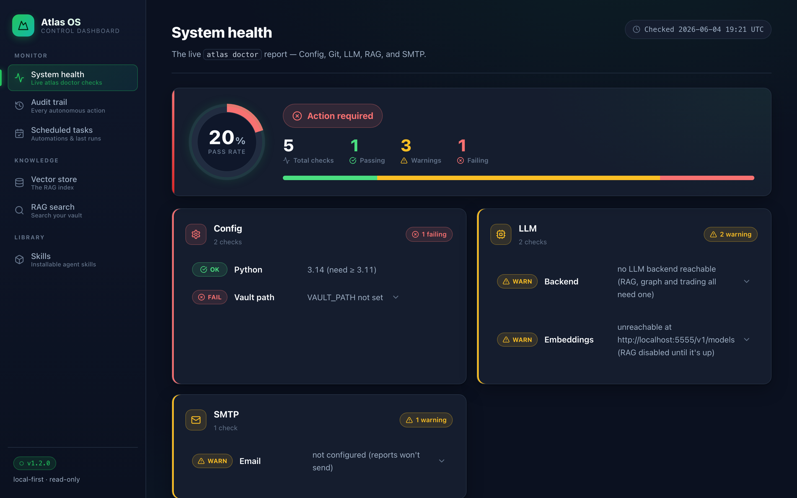

# Feature: Web Dashboard

**Source:** [`eidetic_os/dashboard/`](../../eidetic_os/dashboard/) ·
**CLI:** `eidetic dashboard`

A lightweight, local-first web UI over the things you already run from the
`eidetic` command line. It surfaces seven panels — system health, the audit trail,
scheduled tasks, the skills catalog, the knowledge graph, vector-store stats, and
RAG search — in a clean dark theme, with no build step and only one client-side
dependency (D3, used by the graph page).



It is a **view** over your machine, never a second source of truth: every number
is read live from the existing Eidetic OS modules (`vectordb`, `audit`, `_skills`,
`packs`, and `eidetic doctor`'s own checks). It reads from your local machine only.

---

## Launch

The dashboard ships as an **optional extra** so the core install stays slim
(Flask + Jinja2 only — no client-side framework):

```bash
pip install 'eidetic-os[dashboard]'     # or: uv pip install 'eidetic-os[dashboard]'
eidetic dashboard                        # serves http://127.0.0.1:8501 and opens a browser
```

| Flag | Default | Meaning |
|---|---|---|
| `--host` | `127.0.0.1` | Interface to bind. Keep it on localhost. |
| `--port`, `-p` | `8501` | Port to serve on. |
| `--open` / `--no-open` | `--open` | Open (or don't open) a browser tab on start. |
| `--debug` | off | Flask debug mode — auto-reload and in-browser tracebacks. |

If the extra isn't installed, `eidetic dashboard` prints a one-line install hint
and exits rather than throwing a traceback.

---

## Panels

| Panel | Route | What it shows |
|---|---|---|
| **System health** | `/health` | The live `eidetic doctor` report — Config, Git, LLM, RAG, SMTP — with green / amber / red indicators and the same next-step hints the CLI prints. |
| **Audit trail** | `/audit` | A paginated, newest-first view of the JSONL audit log, filterable by action and a `--since`-style date window. |
| **Scheduled tasks** | `/scheduled` | Every schedulable skill, its suggested cadence, whether it's installed, and its last recorded run (matched from the audit trail). |
| **Skills** | `/skills` | The full skills catalog with install state, plus the curated **packs** — each with a one-click *Install pack* button. |
| **Knowledge graph** | `/graph` | A D3 force-directed view of how your notes connect via `[[wikilinks]]`: nodes coloured by type (session log, source, skill, research, wiki, memory, note), zoom/pan, search, per-type filters, and a click-through panel of each note's links and backlinks. Data comes from `GET /api/graph` (a live vault scan). Also reachable with `eidetic graph --open`. |
| **Vector store** | `/vectors` | Chunk count, files indexed, cached embeddings, database size, search backend (sqlite-vec vs brute-force), and last-embed time. |
| **RAG search** | `/search` | A search box that runs the same engine as `eidetic search` (hybrid / vector / keyword), rendering ranked results with scores and snippets. |

---

## Architecture

Two layers, deliberately separated:

- **`eidetic_os/dashboard/data.py`** — pure, Flask-free functions that gather and
  shape data for templates (`health_report`, `audit_page`, `scheduled_tasks`,
  `skills_overview`, `graph_data`, `vector_stats`, `run_search`, …). They never raise for the
  ordinary "not set up yet" states (no vault, no index, no endpoint) — those are
  rendered as amber panels — so the dashboard degrades gracefully. This layer
  imports without Flask and is unit-tested directly.
- **`eidetic_os/dashboard/app.py`** — a thin Flask routing layer
  (`create_app()`), Jinja2 templates under `templates/`, and one hand-written
  dark-theme stylesheet under `static/`.

RAG search shells out to `scripts/rag_search.py --json` (the same script
`eidetic search` drives), so the dashboard's results are identical to the CLI's
and a missing embeddings endpoint can't take the page down.

---

## Privacy

The dashboard binds to `127.0.0.1` by default and is **read-only** apart from the
skill-pack install buttons (which write only into your scheduled-tasks
directory). Do not expose it on a public interface with your vault data behind
it, and never commit generated data (`vectors.db`, audit logs). See
[`../../SECURITY.md`](../../SECURITY.md).

> The single-file [`templates/ops-dashboard.html`](../../templates/ops-dashboard.html)
> static template still exists for embedding `eidetic health --json` /
> `eidetic changelog --json` into your own page; `eidetic dashboard` is the
> batteries-included alternative.
